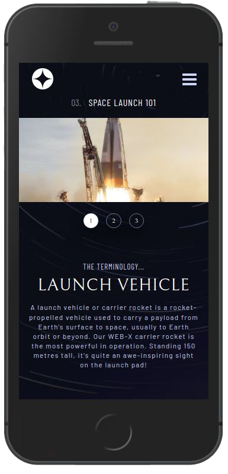
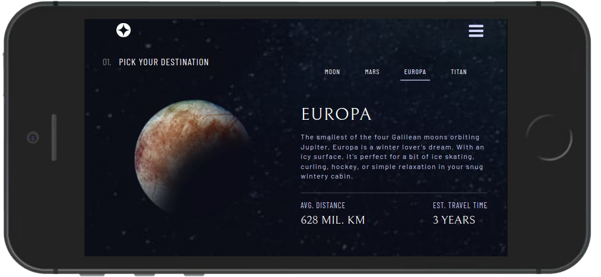

# Custom Threads

<div style="display: flex">


</div>

<br>
<br>

A React-based, fully responsive website that uses JSON data and combines creative design and space adventures.

This project was a lovely opportunity to follow a provided, structured Figma design and bring to life. It implements lazy loading and component/page animations, and is based on TypeScript, Redux Toolkit, Styled Components and Framer Motion. For a detailed overview, please have a look at the [**Features**](#features) & [**Tech**](#tech) section.

**Important Note**: All of the image assets, along with the design files were provided by Frontend Mentor, as part of the _Space tourism multi-page website_ challenge.

<br>

## Installation

As this project was bootstrapped with React, the following scripts are available:

**Install** the dependencies:

```
npm install
```

Run the app in **development** mode:

```
npm start
```

Launch the **test server** in the interactive watch mode:

```
npm test
```

## <a id='features'></a>Features

-   Dynamic website background based on path.
-   JSON-fetched data with a custom hook to facilitate only essential data extraction.
-   Animated page transitions and component presentation.
-   Fully-responsive in both landscape & portrait mode.

## <a id='tech'></a>Tech

-   React
-   TypeScript
-   React Router
-   Redux Toolkit
-   Styled Components
-   Framer Motion
-   Lodash
-   React Content Loader
-   React Icons

For a more detailed overview of the development & production dependencies, please check `package.json`.

## Live Version

<https://developedbygeo.github.io/Space-travel/>

## Contributing

Contributions are certainly welcome. Please feel free to open an issue/PR if there is something you would like to be changed.

## Acknowledgements

A massive thank you to The Odin Project, freeCodeCamp & Frontend Mentor for their guidance and quality material.

## License

[MIT](./LICENSE.md)
